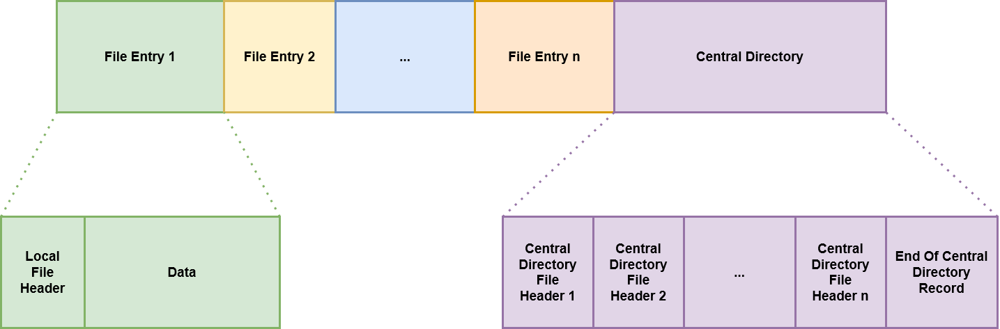

# Background Information

The purpose of this document is to present the research done in making certain design decisions. It also serves as a
summary for the subset of the zip specification that this library uses.

## High Level Motivation

The idea behind the Wasm-Zip is to offer web applications the ability to allow users to download an archive of
resources that are already present on the client, without the need to contact a server to generate an archive for
download. This allows for increased privacy, lower costs and potentially simpler hosting architecture.

Presently, Wasm-Zip creates zip archives without any compression applied. The zip file format was chosen due to its
ubiquity across all operating systems. The absence of compression was a simplifying decision made due to the fact that
there are no bandwidth costs associated with a download directly from the client.

## Zip Archive Creation

Zip archives are split into 2 sections:

1. The file entries.
2. The central directory.

A simplified layout of a zip archive is shown below:

Wasm-ZIp produces a binary blob by concatenating rust vectors that represent each of the sections in the above diagram.
While not the most efficient approach, it is significantly more declarative and easy to ensure correctness.

It is important to note that header fields are typically stored in little-endian byte ordering.
This means within a field of data in a zip file header, the least significant byte is stored first.
For example, the local file signature `0x04034B50` would be stored as `[0x50, 0x4B, 0x03, 0x04]` within the first 4
bytes of memory.

### File Entry Structure

#### Local File Header

| Field Offset (bytes) | Size (bytes) | Description                                                                                                                                                                                                                               |
|----------------------|--------------|-------------------------------------------------------------------------------------------------------------------------------------------------------------------------------------------------------------------------------------------|
| 0                    | 4            | Local file header signature. Always set to `0x04034B50`.                                                                                                                                                                                  |
| 4                    | 2            | Minimum version needed to extract the file. Set to `0x000A` by Wasm-ZIp.                                                                                                                                                                  |
| 6                    | 2            | General purpose bit flag. Used to for additional features such as encryption. Wasm-ZIp does not utilise these features. Therefore, it is set to `0x0000`.                                                                                 |
| 8                    | 2            | Compression method. Wasm-ZIp sets this to `0x0000` to indicate that no compression is used. Data is simply stored.                                                                                                                        |
| 10                   | 2            | File last modified time in MS-DOS formatting [2].                                                                                                                                                                                         |
| 12                   | 2            | File last modified date in MS-DOS formatting [2].                                                                                                                                                                                         |
| 14                   | 4            | CRC-32 of the file data. Wasm-ZIp uses the ISO HDLC algorithm.                                                                                                                                                                            |
| 18                   | 4            | Compressed size of the file data (without the file name). This is the same as the uncompressed size in the case of zips without compression.                                                                                              |
| 22                   | 4            | Uncompressed size of the file data (without the file name).                                                                                                                                                                               |
| 26                   | 2            | The length of the file name.                                                                                                                                                                                                              |
| 28                   | 2            | The extra field length. Wasm-ZIp does not use extra fields. Therefore, this is set to `0x0000`.                                                                                                                                           |
| 30                   | n            | The file name as bytes. Note that characters are stored in the same order they appear in the string (ignore endian-ness). Also note that folders are represented by including a forward slash in the file name eg. `MyFolder/MyFile.txt`. |
| 30 + n               | m            | Extra field. Unused by Wasm-ZIp, therefore completely omitted.                                                                                                                                                                            |

### File Data

File data is simply the bytes that represent any file.
For example, a text file with the contents `Hello!` would be represented by the
bytes `[0x48, 0x65, 0x6C, 0x6C, 0x6F, 0x21]` with UTF-8 encoding.
This data is placed immediately after its corresponding local file header.
Note that the file bytes are left in order. There is no need to consider endian-ness.

### Central Directory Structure

#### Central Directory Header

| Field Offset (bytes) | Size (bytes) | Description                                                                                                                                                                                                                                                    |
|----------------------|--------------|----------------------------------------------------------------------------------------------------------------------------------------------------------------------------------------------------------------------------------------------------------------|
| 0                    | 4            | Central directory file signature. Always set to `0x02014B50`.                                                                                                                                                                                                  |
| 4                    | 2            | Version this archive was created by. Wasm-ZIp sets this to `0x003F`.                                                                                                                                                                                           |
| 6                    | 2            | Minimum version needed to extract the file. Set to `0x000A` by Wasm-ZIp.                                                                                                                                                                                       |
| 8                    | 2            | General purpose bit flag. Used to for additional features such as encryption. Wasm-ZIp does not utilise these features. Therefore, it is set to `0x0000`.                                                                                                      |
| 10                   | 2            | Compression method. Wasm-ZIp sets this to `0x0000` to indicate that no compression is used. Data is simply stored.                                                                                                                                             |
| 12                   | 2            | File last modified time in MS-DOS formatting [2].                                                                                                                                                                                                              |
| 14                   | 2            | File last modified date in MS-DOS formatting [2].                                                                                                                                                                                                              |
| 16                   | 4            | CRC-32 of the file data. Wasm-ZIp uses the ISO HDLC algorithm.                                                                                                                                                                                                 |
| 20                   | 4            | Compressed size of the file data (without the file name). This is the same as the uncompressed size in the case of zips without compression.                                                                                                                   |
| 24                   | 4            | Uncompressed size of the file data (without the file name).                                                                                                                                                                                                    |
| 28                   | 2            | The length of the file name.                                                                                                                                                                                                                                   |
| 30                   | 2            | The extra field length. Wasm-ZIp does not use extra fields. Therefore, this is set to `0x0000`.                                                                                                                                                                |
| 32                   | 2            | The length of the file comment. Wasm-ZIp does not add comments. Therefore, this is set to `0x0000`.                                                                                                                                                            |
| 34                   | 2            | The disk number where the file starts. This field is typically used where the archive is split across multiple disks (eg. floppy disks). Given that there is no need for such a field in the archive's Wasm-ZIp will be dealing with, this is set to `0x0000`. |
| 36                   | 2            | Internal file attributes. This can be used to indicate whether the files are ASCII or binary. There is no difference in functionality when it comes to stored archives. Therefore, this is set to `0x0000`.                                                    |
| 38                   | 4            | External file attributes. Used to indicate things like the file system and operating system on which the archive was created. Given that Wasm-ZIp operates within Web Assembly memory, none of the provided options make sense. This is set to `0x0000`.       |
| 42                   | 4            | The relative offset of the local file header that corresponds to this central directory header. This is the offset in bytes from the start of the archive to where the local file header first appears.                                                        |
| 46                   | n            | The file name as bytes. Note that characters are stored in the same order they appear in the string (ignore endian-ness). Also note that folders are represented by including a forward slash in the file name eg. `MyFolder/MyFile.txt`.                      |
| 46 + n               | m            | Extra field. Unused by Wasm-ZIp, therefore completely omitted.                                                                                                                                                                                                 |
| 46 + n + m           | k            | File comment. Unused by Wasm-ZIp, therefore completely omitted.                                                                                                                                                                                                |

#### End Of Central Directory Record

| Field Offset (bytes) | Size (bytes) | Description                                                                                                                                                                                                |
|----------------------|--------------|------------------------------------------------------------------------------------------------------------------------------------------------------------------------------------------------------------|
| 0                    | 4            | End of central directory signature. Always set to `0x06054B50`                                                                                                                                             |
| 4                    | 2            | Number of this disk. This is typically used when the archive has been split across multiple disks. Given that Wasm-ZIp does not split archives, this is set to `0x0000`.                                   |
| 6                    | 2            | Number of the disk where the central directory starts. This is typically used when the archive has been split across multiple disks. Given that Wasm-ZIp does not split archives, this is set to `0x0000`. |
| 8                    | 2            | Number of central directory records on this disk. This is equal to the total number of central directory records since Wasm-ZIp does not split archives.                                                   |
| 10                   | 2            | The total number of central directory records.                                                                                                                                                             |
| 12                   | 4            | The size of the central directory in bytes. This can be calculated by adding up the length of all central directory headers. The length of the end of central directory record should not be included.     |
| 16                   | 4            | The offset of the start of the central directory. This can be calculated by adding up the lengths of all local file headers and file data sections, as the central directory appears directly after these. |
| 20                   | 2            | File comment length. Unused by Wasm-ZIp, therefore set to `0x0000`.                                                                                                                                        |
| 22                   | n            | Wasm-ZIp does not use comments. This field is completely omitted.                                                                                                                                          |

## References

1. PKWARE Inc., ".ZIP File Format Specification", `https://pkware.cachefly.net/webdocs/casestudies/APPNOTE.TXT`, 2020.
2. Microsoft Corporation, "DosDateTimeToFileTime function"
   , `https://docs.microsoft.com/en-us/windows/win32/api/winbase/nf-winbase-dosdatetimetofiletime`,
   Apr, 2021.